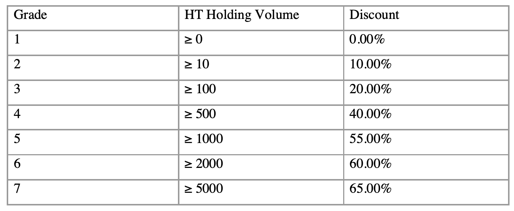

# The latest Announcement

## Announcement of HSC that 26 Anchor Tokens to be Launched in Hoo Ecological Chain HSC

Dear users: Anchor tokens of WBTC、CRO、FTT、GRT、MKR、COMP、UMA、NEXO、REN、ZRX、BAT、OMG、BNT、MATIC、ZKS、1INCH、NPXS、CRV、HOT、RSR、MANA、ACH 、MUSK、MX、TRIO and YCC will be launched on HSC soon. Please wait for the official announcement of the specific opening time.

Name	                      HSC Contract Address

HSC-Peg WBTCHSC Token	   0x70D171d269D964d14aF9617858540061e7bE9EF1

HSC-Peg CRO Token	        0xF7e1E39e239C5A920849f435F66097D2e412859e

HSC-Peg FTT Token	        0xC7f7a54892B78b5c812c58d9Df8035FcE9F4D445

HSC-Peg GRT Token	        0xfAdD0c7762c59cEBC5248019dBAC652319CEBDbd

HSC-Peg MKR Token	        0x34D75515090902a513F009f4505A750efaaD63b0

HSC-Peg COMP Token	       0xCe0A5CA134fb59402B723412994B30E02f083842

HSC-Peg UMA Token	        0xe2563F0a1787ac8a9fA67f3124a3d0AE92d574d2

HSC-Peg NEXO Token	       0x3a6B8B642aa154bAdA89eD3730C9E820Da79AD24

HSC-Peg REN Token	        0x212208bcc81F3a2D0188afF76A2d39351eb53b96

HSC-Peg ZRX Token	        0x0212dA773704cbc4F476bA827406363c87E8D3Bd

HSC-Peg BAT Token	        0xb04Ee982E6329FeBe4c70A53d1725469A1F6963A

HSC-Peg OMG Token	        0x359aA457CC0eF0a64b8Aa7e4EcD967DfB30cEF48

HSC-Peg BNT Token	        0x756a3dCF7171Ad147A801318a7caB3284cFf6a85

HSC-Peg MATIC Token	      0xdB11743fe8B129b49b11236E8a715004BDabe7e5

HSC-Peg ZKS Token	        0xe25A7D0B6bcDa2a832d255edef1387E72d20883b

HSC-Peg 1INCH Token	      0xD192f8e3224Ff0f48B08DB4791576B6878B426A0

HSC-Peg NPXS Token	       0x7b92E0aF7aE7de1c65710869F691231772A8B927

HSC-Peg CRV Token	        0x6BCE534a02f8347f747124082Ef3e35Dd696748D

HSC-Peg HOT Token	        0x26dB8742DA87d2E74911BFA4A349D4f6F7fc6037

HSC-Peg RSR Token	        0x8f6303C8a21398c91abB5EfF3b3C9315CA59CbE8

HSC-Peg MANA Token	       0x09006b66d89e5213Fc173403AACBA30620A91F4e

HSC-Peg ACH  Token	       0x4a31D1Ad7430586752A1888fE947E3E7D52aFfB8

HSC-Peg MUSK Token	       0x245A3bb0fB1385522d883D8d8b4a91da17548C07

HSC-Peg MX Token	         0x8d854e603dc777337134286f5b3408261736a88F

HSC-Peg TRIO Token	       0xEb6EbcaF096F99c7701DD6B90a013E6e1A3f0617

HSC-Peg YCC Token	        0x80898823FdD0B961C2E9809eF75B673E7f4aa02D

HSC team

## We Make Future Phase 2 Registration Opened

HSC is a young, dynamic and full of infinite possibilities world. Since its launch, we have welcomed nearly 100 development teams worldwide to start together“Era of Making" and jointly build HSC ecosystem. HSC hopes to provide more efficient support to global developers and reward eco-builders and contributors. 

HSC will launch the second phase of the“We Make Future". Developers can deploy and run DApps on HSC. HSC will assess Top10 based on the registered project operations and award the title of "Golden Creator", as well as provide rewards.

Registration time：
00:00 March 3th - 24:00 March 10th, 2021

Event time：
00:00 March 11th - 24:00 March 31, 2021

Result release: 
April 8th, 2021

Scoring rules：
Current "We Make Future" phase will pay more attention to HSC ecosystem infrastructure creation, so the following types of projects will be more likely to get extra points in the final score: derivatives trading, oracles, auction platforms, stablecoins, NFT, synthetic assets, data services, etc.

HSC Fund will set up evaluation committee and score the projects based on fairness and justice. Scoring dimensions include 4 categories: project characteristics and attributes, on-chain data, market reputation, project potential. Different projects will be assessed based on different dimensions and aspects.

Awards and benefits:
1st and 2nd 'Gold Creator' winners will be recommended to Hoo Global listing audit.
3rd - 5th 'Gold Creator' winners will receive an investment from HSC Fund
6th-10th 'Gold Creator' winners will get HSC alliance members investment or Hoo pool liquidity support up to $ 1 million.
All 'Gold Creator' winners can get HSC global marketing resources support

Registration form：
Please developers through Hoo ecological chain official website: hoochain.com to register or submit an application through the following registration link：

Chinese registration link:https://jinshuju.net/f/mkP0ZU

English registration link:https://docs.google.com/forms/d/1btQP4tg_qpjNjrk70uSb-jW2vooOFr2lM3ImGagXaJg/prefill

* All registration projects can log in to the "creator ecological map" and get the whole network publicity opportunities
Developers are requested to register through the official website of HSC: hoochain.com or submit an application through the following registration link:

Registration link in Chinese : https://jinshuju.net/f/pylg4Q

Registration link in English: :https://docs.google.com/forms/d/e/1FAIpQLSekFxYEznaSJXuzFQFnJlegZeitaL7AiuCdsrNxOCzXDXL5Lw/viewform?usp=sf_link

* All registered projects can log into "We Make Future" Eco Map and get a chance to develope the whole network.

HSC 
March 2st,2021

## HSC Initiates Combating Scam Along with Partners

It has come to our knowledge that there have been projects created with malicious purposes on HSC. And we will take a series of actions to guarantee a safe and healthy developing environment: in-depth security audits on various eco projects, opening source codes, adding time locks and deploying governance contracts.

HSC wants to work with the community with a sincere and honest mindset and using community governance for restraint on bad behaviors. We want to help projects gain more users' trust and participation. For quality projects, HSC will also join hands with partners and continue providing them with strong support. At the same time, to promote the healthy development of the HSC ecosystem, HSC and its partners will ONLY support projects that complete security audits, open source, and decentralized. HSC will boycott the projects that are not. 

HSC recommends frequent community participation in DeFi rationally and for users to carefully understand and study how the project works, the team's background, and the code before participation. Do not participate in unaudited, non-open source projects.

In order to promote the development of quality projects, HSC has joined hands with well-known auditing organizations to provide green audit channels for HSC eco-projects and take practical measures to help the healthy development of HSC eco-projects.

HSC Team

## MX, native token of MXC platform, will be cross-linked into HSC.

Dear users，

Hoo Eco Chain HSC and MXC platform have deepen their cooperation. The content and methods of cooperation are as follows:

1. A native token of MXC platform, MX will be directly connected to HSC as a a cross-chain asset through MXC and Hoo Global platforms deposit and withdrawal functions. MX will be used as a DeFi asset for lending, liquidity mining, DEX transactions and other operations in HSC.

2. MXC will be launched on HSC Asset Zone to jointly create diversified eco application scenarios.

HSC team

## 19 Anchor Tokens to be Launched in Hoo Ecological Chain HSC

Dear users: 

Anchor tokens of AAVE、ARPA、BAL、BETH、CNNS、DAI、GOF、HBC、LAMB、LINK、LRC、PAX、SKM、SNX、SUSHI、SWFTC、UNI、USDC and YFI will be launched on HSC soon. Please wait for the official announcement of the specific opening time.

HSC team

## HSC Airdrop Week

Dear Users, 

Chinese New Year is coming, and HSC jointly launched New Year 1.5 million campaign "HSC Airdrop Week" with 12 top projects on HSC chain. Thank you for your strong support for HSC and HSC Ecosystem.

Activity time:04-09/02/2021

Activity rules：
During this activity, users can participate in airdrops initiated by HSC projects and get rewards according to the rules issued by each project. A total of 12 airdrops initiated by 2-3 projects a day. Airdrops are independent of each other, users can participate in any of them. Users can view 'HSC Airdrop week' schedule and learn more about airdrops and rules on DeFibox.com.

Airdrop projects and time:

February 4 - LAVAswap

February 5 - BeeSwap, Channels

February 6 - BasisX, Lendhub

February 7 - FilDA, NFT-HERO

February 8 - EarnDeFi, MDEX

February 9 - CROSS, BAGS, DMEX

Partner platform:
DeFibox.com

Partner walelts:
Hoo Wallet, CodeBank, BitKeep, TokenPocket, Bitpie, ONTO, Hyperpay, MetaMask, Dappbirds 

Partner media:
金色财经、Winkrypto、火星财经、币世界、COINTELEGRAPH、KingData

Activity notice:
1. You can participate in 12 airdrops at the same time.
2. Airdrop rewards will be distributed by the project after the address is approved. It takes time, please wait.
3. Please strictly follow the airdrop rules. If the user commits any illegal operation that affects the normal operation of the activity, HSC will immediately disqualify this user from participating and he will not be able to receive any airdrop.
4. The final interpretation right of a single airdrop belongs to the relevant project. 
5. HSC is this activity organizer, but does not provide with any investment advice. Users are requested to participate with caution.

## RPC servers update

Dear HSC users, for your better experience, please choose RPC server according your location:

Global: https://http-mainnet-node.Hoochain.com

China mainland: https://http-mainnet.hoochain.com

## HSC Eco Alliance Announces First Exchange Membership List

HSC Eco Alliance officially announced the first list of exchanges. Nine exchanges including BiBox, BiKi, BigONE, BitZ, HBTC, Hoo, LBank, MXC and Jubi joined the HSC Eco Alliance as partners to support the HSC Eco Alliance project.

The HSC Eco Alliance was founded on January 14, 2021 by HSC, the Firecurrency Eco-chain. The HSC Eco-Alliance aims to combine top investment institutions, trading platforms, wallets, media and other projects in the industry to enable HSC eco-projects, support high-quality developers around the world and jointly promote HSC eco-prosperity and development.

The HSC Eco Alliance will support high-quality developers with resources such as investment, trading, fluidity, and brand to help them grow quickly.

## Hoo DeFi Labs set up HSC Fund to accelerate the development of projects on the Hoo ECO Chain

On December 21, Hoo Defi Labs announced the launch of the "HSC Fund". It is designated to support Hoo Open Platform as well as the projects on the Hoo ECO Chain, so as to promote the prosperity of Hoo Ecosystem. The recent focus of the HSC Fund is to discover and support high-potential projects which include DEX, Lending, Oracle, Cross-chain solution, Stable currency exchange, Insurance, etc.

Hoo DeFi Labs is the platform for DeFi research, investment，incubation, and ecosystem building, dedicated to build a new financial system in collaborations with the global crypto and DeFi community for the future.

The Hoo Open Platform is a unified infrastructure platform based on the technical, traffic and ecological resources of the Hoo Group, which will be gradually open to the blockchain industry. It will make the construction of decentralized applications more efficient and cost-effective, and provide comprehensive empowerment in aspects of promotion, traffic, and resources. In December 2020, the first product of the Hoo Open Platform, the Hoo ECO Chain, also known as HSC, officially launched its "Tinder" phase.

## Hoo ECO Chain is officially launched

Dear customer, 

Hoo ECO Chain, also known as HSC, is officially launched on 21st Dec. 2020，with characteristics such as high performance, low gas fee, and better cross-chain user experience, etc.

The Meta-transaction function adopted by HSC enables developers with better on-chain operations, of which the essence is to cover the gas fee payment, and the purpose is to reduce the cost of users using HSC services. In other words, HSC intends to subsidize users by paying a part of their gas fee in accordance with their HOO holding volume. In addition, sepecial gas fee subsidy could be given for specific DApps.

HSC is divided into 4 phases: Tinder, Spark, Flame, Blaze. The first stage of "Tinder" starts on 21st Dec. 2020. The second stage of "Tinder" will start on Q1 2021, at the appointed time the public recruitment of HSC nodes will be carried out.

Risk warning：

1. All users and developers can participate in the test environment and subsequent stages of the HSC for free, and there is no charge.

2. Please distinguish between the test environment and the mainnet network. The assets generated by the test environment have no value. Be aware of counterfeit currency fraud.

3. Hoo ECO Chain will announce authorization, promotion and other cooperation through the official social platform. Warmly remind developers and users to double check the information to avoid losses.

4. Please identify the official website (hoochain.com ) to avoid private key phishing.

## Hoo ECO Chain " WE MAKE FUTURE "program is open now for registration 
 
Dear users, 
 
HSC is a whole new world, and we warmly welcome global developers to co-start the "Era of Making". Developers can deploy and run DApps on HSC. We will evaluate and award the Top5 projects with the title "Gold Creator" and a package of rewards. 
 
Registration time: 
17:00 25th Dec. 2020 - 24:00 29th Dec. 2020  
 
Duration: 
2020年12月30日00:00-2021年1月19日24:00  
00:00 30th Dec. 2020 - 24:00 19th Jan. 2021 
 
Attention:  
The daily average on-chain statistics are only valid within 20 days from 00:00 30th Dec. to 24:00 19th Jan.. Please pay attention to the beginning and ending times of your data.  
 
Result release: before 27th Jan. 2021 
 
Scoring rule:  
HSC Fund will set up an evaluation committee to score the projects by the principle of fairness and justice. The scoring dimensions include three categories: on-chain data, market reputation, and project potential. The HSC Fund will evaluate projects based on various tracks and aspects. 
 
 
Awards and benefits: 
The "Gold Creator" title winners will have the opportunity to obtain at least one of the following benefits: 
1. Official title of “Gold Creator” 
2. Recommendation to the Hoo Global listing audit channel 
3. Investment opportunities from the HSC Fund 
4. Liquidity support up to 1 million USD 
5. HSC global marketing resources support 
 
Registration Form in Chinese: https://jinshuju.net/f/mkP0ZU 

Registration Form in English: https://forms.gle/rVYnxdoh7dAc2Cfw5
 
For more details, please visit our website: www.hoochain.com 
 
Risk Warning: 
1. HSC announces authorization, promotion, and other collaborations only through the official social media platform. Developers and users should check carefully to avoid losses. 
2. All users and developers can participate in the test environment and the Mainnet of HSC for free, and there is no charge. 
3. All users must distinguish the test environment from the Mainnet. The assets generated in the test environment have no value. Be aware of counterfeit currency fraud. 
4. The official website is www.hoochain.com. Please be cautious with private key phishing. 
 
Hoo ECO Chain 

25th Dec. 2020 

