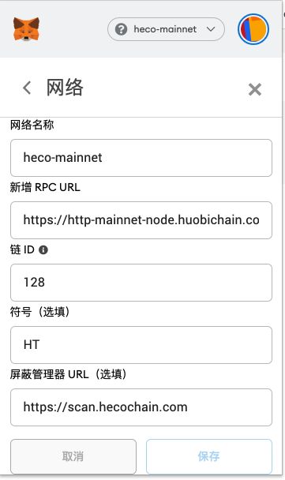

# 概况

支持 metamask、Hoo wallet app、Hoo wallet 浏览器插件

> 注意：提现到钱包之前，请检查兼容性，已知 Ledger 暂未支持

# metamask

下载地址：https://metamask.io/

添加自定义网络：

## 主网

```
chainid: 128
rpc: https://http-mainnet-node.Hoochain.com
scan: https://hooinfo.com
```




## 测试网

```
chainid: 256
rpc: https://http-testnet.hoochain.com
scan: https://testnet.hooinfo.com
```


# Hoo wallet app

https://www.Hoowallet.com/

# Hoo wallet extension

> 待公布

# HSC cointtype

https://github.com/satoshilabs/slips/blob/master/slip-0044.md